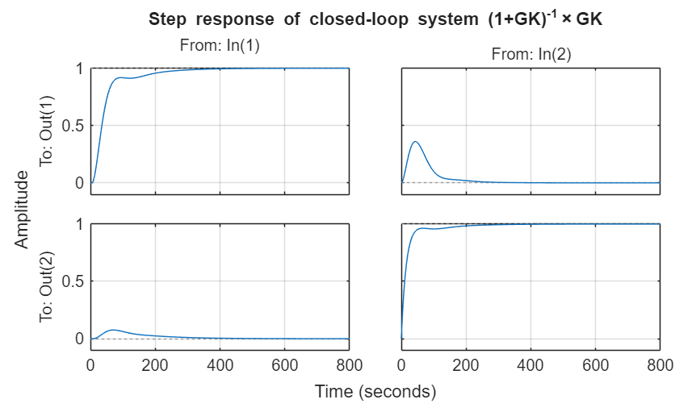
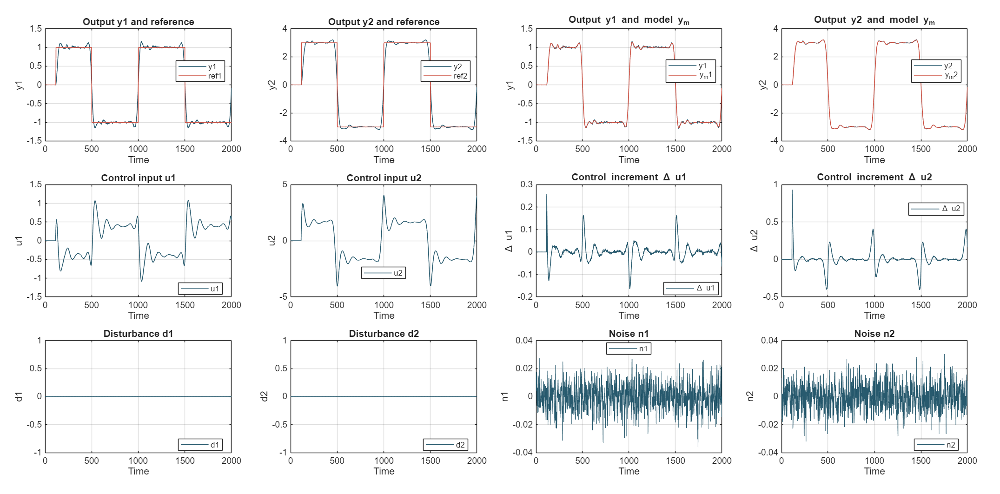

# MIMO MPC Toolbox in MATLAB

This repository provides a MATLAB framework for modeling, simulating, and controlling linear **MIMO** systems using **Dynamic Matrix Control (DMC)** and **direct synthesis methods**.[^1]

It supports RGA-based pairing analysis, SISO controller design per paired channel, and closed-loop MPC simulations with programmable references, disturbances, and noise.

***

## Overview

- Object‑oriented `MIMOSystem.m` class for LTI MIMO plants
- **RGA analysis** (`computeRGA()`, `staticRGA_analysis()`) for input-output pairing
- **Direct synthesis** controller design for paired channels (`DirectSynthesis()`)
- **DMC-style MPC** with step-response prediction model
- **Closed-loop simulation** (`simMPC()`) with references, disturbances, noise
- **Automatic plotting** (`MPCplot()`) of all key signals
- **Reference generator** (`referenceInput.m`) for multi-channel trajectories

***

## Repository Structure

```text
MIMO_MPC_Toolbox/
├─ MIMOSystem.m        % Core class: plant + analysis + controllers + simulation
├─ referenceInput.m    % Multi-channel reference trajectory generator  
├─ main_mimo_demo.m    % Demo script (create this to run examples)
└─ README.md           % This documentation
```


***

## Getting Started (Complete Workflow)
Given a systems's transfer matrix:

$$G(s) = \begin{bmatrix} 
\frac{2.6}{1+62s} & \frac{1.5}{(1+23s)(1+62s)} \\ 
\frac{1.4}{(1+30s)(1+90s)} & \frac{2.8}{1+90s} 
\end{bmatrix}$$


```matlab
%% 1. Define MIMO plant
s = tf('s');
G11 = 1/(s+1);  G12 = 0.5/(s+2);
G21 = -0.3/(s+3); G22 = 2/(s+1);
G = [G11 G12; G21 G22];

%% 2. Create system object
MIMO_sys = MIMOSystem(G);

%% 3. RGA analysis & pairing (square systems only)
MIMO_sys.computeRGA();
MIMO_sys.staticRGA_analysis();
% Output: 
% Static RGA Analysis:
%    1.4054  -0.4054
%   -0.4054   1.4054
% Output 1 ↔ Input 1 (RGA=1.41), Output 2 ↔ Input 2 (RGA=1.41)

%% 4. Direct synthesis controller design
control1.model = "SOPTD"; control1.tau = NaN; control1.zeta = 0.8; control1.wn = 0.05; control1.theta = 5;
control2.model = "FO"; control2.tau = 15; control2.zeta = NaN; control2.wn = NaN; control2.theta = NaN;
desiredCL = [control1, control2];
MIMO_sys = MIMO_sys.DirectSynthesis(desiredCL);
K = MIMO_sys.Kc;  % Decentralized controller matrix

%% 5. Verify closed-loop (optional)
T = feedback(G*K, eye(size(G,1)));  % T(s) = GK/(1+GK)
figure; step(T); grid on;
title('Step response of closed-loop system T(s) = GK/(1+GK)');

%% 6. DMC MPC design
mpcParams.model = 'DMC'; mpcParams.modelHorizon = 50;
mpcParams.predictionHorizon = 50; mpcParams.controlHorizon = 30;
mpcParams.method = 'programmed'; mpcParams.alpha = 0.01;
mpcParams.Q = 1; mpcParams.R = 2;
MIMO_sys = MIMO_sys.MPCdesign(mpcParams);

%% 7. Simulation setup
ts = MIMO_sys.sampleTime; t = (0:ts:2000)';
[num_out, num_in] = size(MIMO_sys.G);

% References
yRef = referenceInput(num_out, t, mpcParams.predictionHorizon, 'square', 1000, [0 0], [1 3], mpcParams.alpha);

% Disturbance + noise
disturbance = zeros(numel(t), num_out); disturbance(300:500,1)=0.5; disturbance(600:700,2)=-0.7;
noise = 0.01 * randn(numel(t), num_out);

%% 8. Run MPC simulation
[index, Y, Ym, U, dU] = MIMO_sys.simMPC(t, yRef, noise, disturbance);

%% 9. Plot everything
MIMO_sys.MPCplot(t, index, Y, Ym, yRef, U, dU, disturbance, noise);
```

## Simulation Results
### Multiloop design with direct synthesis


---
### Multivariable MPC design with DMC method




***

## Key Features

### 1. **RGA Analysis**

```matlab
MIMO_sys.computeRGA();           % Λ(s) = G(s) ∘ (G(s)^(-T))
MIMO_sys.staticRGA_analysis();   % Λ(0), prints pairing recommendations
```

Only for square, invertible plants. Pairs outputs to inputs maximizing |RGA| values.

### 2. **Direct Synthesis**

Designs **decentralized controllers** for paired channels:

```matlab
% FO, FOPTD, SO, SOPTD models supported
control1.model = "FO"; control1.tau = 20;
desiredCL = [control1, control2];
MIMO_sys.DirectSynthesis(desiredCL);  % fills obj.Kc
```

Uses `sisoDesign()` internally per paired channel.

### 3. **DMC MPC**

Step-response model, quadratic cost

$$
J = \sum_{i=1}^{P} \| \hat{y}(k+i|k) - r(k+i) \|_Q^2 + 
\sum_{j=1}^{M} \| \Delta u(k+j|k) \|_R^2,
$$

explicit gain:

$$
K_c = (S^\top Q S + R)^{-1} S^\top Q
$$

### 4. **Reference Generator**

```matlab
Ref = referenceInput(num_out, t, Np, 'square', T, shiftscale, amplitudes, alpha)
```

Multi-channel sine/square waves with phase shifts and smoothing filter.

***

## System Properties

After initialization, `MIMO_sys` contains:


| Property | Description |
| :-- | :-- |
| `G` | Transfer function matrix |
| `Kdc` | Steady-state gains `dcgain(G)` |
| `RGA.dynamic` | Frequency-dependent RGA |
| `RGA.static` | Steady-state RGA |
| `pairing` | Binary pairing matrix from RGA |
| `sampleTime` | Recommended `Ts` from fastest pole |
| `SR{i,j}` | Step responses for DMC model |
| `Kc` | Controller gain (direct synth or MPC) |
| `mpcParam` | MPC tuning parameters |


***

## MPC Parameters

| Parameter | Role |
| :-- | :-- |
| `modelHorizon (N)` | Step response truncation |
| `predictionHorizon (P)` | Output prediction steps |
| `controlHorizon (M)` | Optimized $\Delta u$ block moves |
| `Q, R` | Output/input weights (scalar → block diagonal) |
| `method` | `'programmed'` (trajectory) vs `'unprogrammed'` (constant) |
| `alpha` | Reference trajectory smoothing |


***

## Extending

- **Non-square RGA**: Add `pinv(G')` pseudo-inverse support
- **Constraints**: Modify `controlSignal()` for saturation checking
- **Disturbance generator**: Create `disturbanceInput.m` like `referenceInput.m`
- **State-space MPC**: Add `ss` model support in `dmcDesign()`

***

## 📚 Reference

**Process Dynamics and Control (4th Edition)**
Dale E. Seborg, Thomas F. Edgar, Duncan A. Mellichamp, Francis J. Doyle III
ISBN-13: 978-1119285915

**RGA**: Chapter 18 (Multiloop and Multivariable Control)
**Direct Synthesis**: Chapter 12 (PID Controller Design, Tuning, and
Troubleshooting)
**MPC/DMC**: Chapter 20 (Model Predictive Control)

***

## 👤 Author

**Alireza Esmailnezhad**

Control Systems Engineer

Tehran - Iran

<div align="center">⁂</div>

[^1]: MIMOSystem.m

